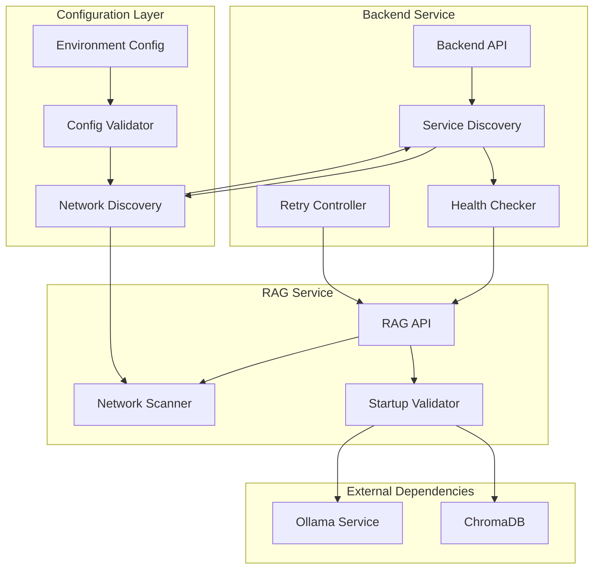

# Design Document

## Overview

This design addresses the RAG service connectivity issues where the backend service cannot establish connections to the RAG service, resulting in "ECONNREFUSED" errors. The root cause analysis reveals a configuration mismatch: the backend is configured to connect to `192.168.56.1:8081` while the RAG service runs on `0.0.0.0:8001`. This design provides a comprehensive solution including automatic service discovery, network configuration validation, improved error handling, and robust startup procedures.

## Architecture

### Current Architecture Issues

1. **Port Mismatch**: Backend expects RAG service on port 8081, but RAG service runs on port 8001
2. **Host Configuration**: Backend uses specific IP `192.168.56.1` which may not be accessible
3. **No Service Discovery**: Services use hardcoded network addresses without validation
4. **Limited Error Handling**: Connection failures provide minimal diagnostic information
5. **Manual Configuration**: Network settings require manual coordination between services

### Proposed Architecture



## Components and Interfaces

### 1. Network Discovery Service

**Purpose**: Automatically detect available network interfaces and determine optimal service addresses.

**Interface**:
```typescript
interface NetworkDiscoveryService {
  discoverServiceEndpoints(): Promise<ServiceEndpoint[]>;
  validateConnectivity(endpoint: ServiceEndpoint): Promise<boolean>;
  getOptimalEndpoint(endpoints: ServiceEndpoint[]): ServiceEndpoint;
}

interface ServiceEndpoint {
  host: string;
  port: number;
  protocol: 'http' | 'https';
  reachable: boolean;
  responseTime?: number;
}
```

### 2. Service Discovery Client

**Purpose**: Locate and validate RAG service availability from the backend.

**Interface**:
```typescript
interface ServiceDiscoveryClient {
  findRAGService(): Promise<ServiceEndpoint | null>;
  healthCheck(endpoint: ServiceEndpoint): Promise<HealthStatus>;
  registerServiceEndpoint(endpoint: ServiceEndpoint): void;
}

interface HealthStatus {
  healthy: boolean;
  services: {
    ollama: boolean;
    chromadb: boolean;
  };
  responseTime: number;
  lastCheck: Date;
}
```

### 3. Configuration Validator

**Purpose**: Validate and normalize service configuration across both services.

**Interface**:
```typescript
interface ConfigurationValidator {
  validateNetworkConfig(): ValidationResult;
  normalizeServiceUrls(): NormalizedConfig;
  detectConfigurationIssues(): ConfigIssue[];
}

interface ValidationResult {
  valid: boolean;
  errors: string[];
  warnings: string[];
  suggestions: string[];
}
```

### 4. Resilient HTTP Client

**Purpose**: Enhanced HTTP client with automatic retry, circuit breaker, and service discovery.

**Interface**:
```typescript
interface ResilientHttpClient {
  request<T>(options: RequestOptions): Promise<T>;
  setServiceEndpoint(endpoint: ServiceEndpoint): void;
  enableCircuitBreaker(config: CircuitBreakerConfig): void;
}

interface CircuitBreakerConfig {
  failureThreshold: number;
  resetTimeout: number;
  monitoringPeriod: number;
}
```

### 5. Startup Orchestrator

**Purpose**: Coordinate service startup with dependency validation and network configuration.

**Interface**:
```python
class StartupOrchestrator:
    def validate_dependencies(self) -> ValidationResult
    def configure_network_binding(self) -> NetworkConfig
    def register_service_endpoint(self) -> None
    def wait_for_dependencies(self, timeout: int) -> bool
```

## Data Models

### Service Configuration Model

```typescript
interface ServiceConfig {
  name: string;
  host: string;
  port: number;
  protocol: 'http' | 'https';
  healthEndpoint: string;
  timeout: number;
  retryConfig: RetryConfig;
}

interface RetryConfig {
  maxAttempts: number;
  backoffMultiplier: number;
  maxBackoffMs: number;
  retryableErrors: string[];
}
```

### Network Interface Model

```typescript
interface NetworkInterface {
  name: string;
  address: string;
  family: 'IPv4' | 'IPv6';
  internal: boolean;
  reachableFromBackend: boolean;
}
```

### Diagnostic Information Model

```typescript
interface DiagnosticInfo {
  timestamp: Date;
  networkInterfaces: NetworkInterface[];
  serviceEndpoints: ServiceEndpoint[];
  connectivityTests: ConnectivityTest[];
  configurationStatus: ValidationResult;
}

interface ConnectivityTest {
  source: string;
  target: string;
  success: boolean;
  responseTime?: number;
  error?: string;
}
```

## Correctness Properties

*A property is a characteristic or behavior that should hold true across all valid executions of a system-essentially, a formal statement about what the system should do. Properties serve as the bridge between human-readable specifications and machine-verifiable correctness guarantees.*

<function_calls>
<invoke name="prework">
<parameter name="featureName">rag-service-connectivity-fix

### Property Reflection

After reviewing all properties identified in the prework, several can be consolidated to eliminate redundancy:

- Properties 1.1, 1.3, 1.4, and 1.5 all relate to diagnostic information provision and can be combined into a comprehensive diagnostic property
- Properties 2.1, 2.2, and 2.3 all relate to network binding and configuration consistency and can be unified
- Properties 3.1, 3.4, and 3.5 all relate to error handling and user feedback and can be consolidated
- Properties 4.1, 4.2, and 4.3 all relate to service discovery and configuration validation and can be combined
- Properties 5.1, 5.2, 5.3, 5.4, and 5.5 all relate to diagnostic capabilities and can be unified into comprehensive diagnostic properties
- Properties 7.1, 7.2, 7.3, 7.4, and 7.5 all relate to network configuration detection and handling and can be consolidated

Property 1: Service status diagnostics
*For any* system state, when diagnostic information is requested, the system should provide comprehensive status including service availability, network configuration, and actionable guidance
**Validates: Requirements 1.1, 1.3, 1.4, 1.5**

Property 2: Network binding consistency  
*For any* service startup, the RAG service should bind to a network interface that matches backend expectations and log the actual binding information
**Validates: Requirements 2.1, 2.2, 2.3, 2.4**

Property 3: Port conflict handling
*For any* port conflict scenario, the RAG service should either resolve the conflict or provide clear error messages with resolution guidance
**Validates: Requirements 2.5**

Property 4: Connection retry with exponential backoff
*For any* connection failure sequence, the backend should implement exponential backoff retry logic that eventually succeeds when service becomes available
**Validates: Requirements 3.2, 3.3**

Property 5: User-friendly error messaging
*For any* service unavailability scenario, users should receive clear, actionable error messages rather than technical connection errors
**Validates: Requirements 3.1, 3.4, 3.5**

Property 6: Automatic service discovery
*For any* network configuration, services should automatically discover each other's addresses and adapt to configuration changes
**Validates: Requirements 4.1, 4.2, 4.3, 4.4, 4.5**

Property 7: Comprehensive diagnostics
*For any* connectivity issue, the system should provide bidirectional diagnostic tests, detailed logging, and step-by-step troubleshooting procedures
**Validates: Requirements 5.1, 5.2, 5.3, 5.4, 5.5**

Property 8: Reliable service startup
*For any* startup scenario, the RAG service should validate dependencies, handle startup failures gracefully, and signal readiness appropriately
**Validates: Requirements 6.1, 6.2, 6.3, 6.4, 6.5**

Property 9: Intelligent network configuration
*For any* network environment, the system should automatically detect interfaces, choose optimal addresses, and handle network restrictions
**Validates: Requirements 7.1, 7.2, 7.3, 7.4, 7.5**

## Error Handling

### Connection Error Categories

1. **Service Not Running**: RAG service process is not started
2. **Port Conflicts**: Another service is using the expected port
3. **Network Unreachable**: Host address is not accessible from backend
4. **Configuration Mismatch**: Backend and RAG service have different network settings
5. **Dependency Failures**: Ollama or ChromaDB are not available
6. **Firewall/Security**: Network policies block communication

### Error Recovery Strategies

```typescript
interface ErrorRecoveryStrategy {
  detectErrorType(error: Error): ErrorType;
  getRecoveryActions(errorType: ErrorType): RecoveryAction[];
  executeRecovery(actions: RecoveryAction[]): Promise<boolean>;
}

enum ErrorType {
  SERVICE_NOT_RUNNING = 'service_not_running',
  PORT_CONFLICT = 'port_conflict',
  NETWORK_UNREACHABLE = 'network_unreachable',
  CONFIG_MISMATCH = 'config_mismatch',
  DEPENDENCY_FAILURE = 'dependency_failure',
  NETWORK_POLICY = 'network_policy'
}
```

### Circuit Breaker Implementation

```typescript
class CircuitBreaker {
  private state: 'CLOSED' | 'OPEN' | 'HALF_OPEN' = 'CLOSED';
  private failureCount = 0;
  private lastFailureTime?: Date;
  
  async execute<T>(operation: () => Promise<T>): Promise<T> {
    if (this.state === 'OPEN') {
      if (this.shouldAttemptReset()) {
        this.state = 'HALF_OPEN';
      } else {
        throw new Error('Circuit breaker is OPEN');
      }
    }
    
    try {
      const result = await operation();
      this.onSuccess();
      return result;
    } catch (error) {
      this.onFailure();
      throw error;
    }
  }
}
```

## Testing Strategy

### Dual Testing Approach

The testing strategy combines unit testing and property-based testing to ensure comprehensive coverage:

**Unit Testing Requirements:**
- Unit tests verify specific examples, edge cases, and error conditions
- Integration points between components are tested with concrete scenarios
- Mock external dependencies (Ollama, ChromaDB) for isolated testing
- Test specific network configurations and failure scenarios

**Property-Based Testing Requirements:**
- Use **fast-check** library for TypeScript property-based testing
- Use **Hypothesis** library for Python property-based testing  
- Configure each property-based test to run a minimum of 100 iterations
- Each property-based test must be tagged with a comment referencing the design document property
- Tag format: `**Feature: rag-service-connectivity-fix, Property {number}: {property_text}**`
- Property tests verify universal properties across all valid inputs
- Generate random network configurations, service states, and error conditions

**Combined Coverage:**
- Unit tests catch concrete bugs in specific scenarios
- Property tests verify general correctness across all possible inputs
- Together they provide comprehensive validation of connectivity behavior

### Test Categories

1. **Network Discovery Tests**
   - Unit: Test specific network interface configurations
   - Property: Verify discovery works for any valid network setup

2. **Service Discovery Tests**
   - Unit: Test known service endpoint scenarios
   - Property: Verify discovery succeeds for any reachable service

3. **Configuration Validation Tests**
   - Unit: Test specific configuration mismatches
   - Property: Verify validation catches any invalid configuration

4. **Error Handling Tests**
   - Unit: Test specific error scenarios and recovery
   - Property: Verify appropriate handling for any error type

5. **Startup Orchestration Tests**
   - Unit: Test specific dependency combinations
   - Property: Verify startup succeeds for any valid environment

## Implementation Architecture

### Backend Service Changes

```typescript
// Enhanced RAG service client with automatic discovery
class EnhancedRAGServiceClient {
  private serviceDiscovery: ServiceDiscoveryClient;
  private circuitBreaker: CircuitBreaker;
  private currentEndpoint?: ServiceEndpoint;
  
  constructor() {
    this.serviceDiscovery = new ServiceDiscoveryClient();
    this.circuitBreaker = new CircuitBreaker({
      failureThreshold: 5,
      resetTimeout: 30000,
      monitoringPeriod: 60000
    });
  }
  
  async initialize(): Promise<void> {
    this.currentEndpoint = await this.serviceDiscovery.findRAGService();
    if (!this.currentEndpoint) {
      throw new ServiceDiscoveryError('RAG service not found');
    }
  }
  
  async query(request: QueryRequest): Promise<QueryResponse> {
    return this.circuitBreaker.execute(async () => {
      if (!this.currentEndpoint) {
        await this.initialize();
      }
      return this.makeRequest('/api/query', request);
    });
  }
}
```

### RAG Service Changes

```python
# Enhanced startup with network discovery
class EnhancedRAGService:
    def __init__(self):
        self.network_scanner = NetworkScanner()
        self.startup_orchestrator = StartupOrchestrator()
        self.config_validator = ConfigurationValidator()
    
    async def startup(self):
        # Validate configuration
        validation_result = self.config_validator.validate_network_config()
        if not validation_result.valid:
            raise ConfigurationError(validation_result.errors)
        
        # Wait for dependencies
        dependencies_ready = await self.startup_orchestrator.wait_for_dependencies(timeout=60)
        if not dependencies_ready:
            raise DependencyError("Required services not available")
        
        # Configure network binding
        network_config = self.network_scanner.get_optimal_binding()
        
        # Start service
        await self.start_server(network_config.host, network_config.port)
        
        # Register with service discovery
        await self.register_service_endpoint()
```

### Configuration Management

```typescript
// Unified configuration with automatic validation
interface UnifiedServiceConfig {
  backend: {
    ragServiceUrl: string;
    ragServiceDiscovery: boolean;
    retryConfig: RetryConfig;
  };
  ragService: {
    host: string;
    port: number;
    autoDiscoverNetwork: boolean;
    dependencyTimeout: number;
  };
  network: {
    preferredInterfaces: string[];
    allowedPorts: number[];
    connectivityTestTimeout: number;
  };
}
```

### Diagnostic Tools

```typescript
// Comprehensive diagnostic utilities
class ConnectivityDiagnostics {
  async runFullDiagnostic(): Promise<DiagnosticReport> {
    const report: DiagnosticReport = {
      timestamp: new Date(),
      networkInterfaces: await this.scanNetworkInterfaces(),
      serviceEndpoints: await this.discoverServices(),
      connectivityTests: await this.runConnectivityTests(),
      configurationStatus: await this.validateConfiguration(),
      recommendations: []
    };
    
    report.recommendations = this.generateRecommendations(report);
    return report;
  }
  
  async generateFixScript(report: DiagnosticReport): Promise<string> {
    // Generate platform-specific fix commands
    const commands = [];
    
    if (report.configurationStatus.errors.includes('port_mismatch')) {
      commands.push('# Fix port configuration');
      commands.push('# Update backend .env: RAG_SERVICE_URL=http://localhost:8001');
    }
    
    return commands.join('\n');
  }
}
```

This design provides a comprehensive solution to the RAG service connectivity issues through automatic service discovery, robust error handling, intelligent network configuration, and extensive diagnostic capabilities. The implementation ensures services can reliably find and communicate with each other while providing clear guidance when issues occur.