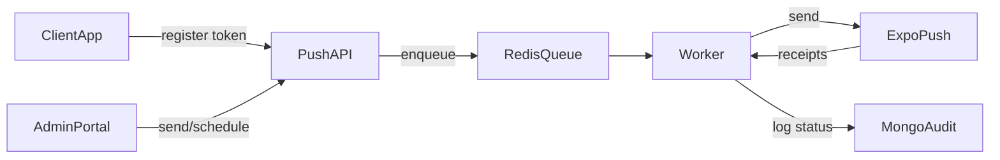

# Self-Hosted Push Notifications (Node.js + Redis + Expo)

## Architecture
- API (`/api/notifications`) accepts token registration, send-now, schedule.
- Redis-backed BullMQ queue (`push:notifications`) for enqueueing, retries, and scheduling.
- Worker (same process) delivers via Expo Push API, checks receipts, deactivates bad tokens.
- Audit trail persisted in Mongo `NotificationLog` with jobId/status/platforms.

## Environment
- `REDIS_HOST`, `REDIS_PORT`, `REDIS_PASSWORD` (TLS/allowlist recommended).
- `PUSH_EXPO_ACCESS_TOKEN` (Expo push service access token).
- `PUSH_QUEUE_PREFIX` (default `push`).
- `PUSH_JOB_ATTEMPTS` (default `3`), `PUSH_JOB_BACKOFF_MS` (default `2000`).
- `PUSH_RECEIPT_DELAY_MS` (default `900000`, 15m receipt check delay).

## API Highlights
- Register token (public): `POST /api/notifications/register` with `pushToken`, `platform`, `deviceInfo`.
- Send/schedule (auth): `POST /api/notifications/send` with `title`, `body`, `type`, `relatedId?`, `scheduledAt?`, `platforms?`, `pushTokens?`, `useQueue?`.
- Stats (auth): `GET /api/notifications/stats` returns active device count + queue counts.
- Logs (auth): `GET /api/notifications/logs?page=&limit=` for audit history.

## Delivery & Reliability
- BullMQ queue with exponential backoff and capped retries.
- Worker marks `jobId`, `status` (`queued|sent|partial|failed`), platforms, scheduledAt.
- Receipt polling after `PUSH_RECEIPT_DELAY_MS`; deactivates `DeviceNotRegistered` tokens.
- Filters by platform; accepts explicit token lists.

## Security & Compliance
- Tokens and logs stored only on gov-managed Mongo/Redis.
- Use HTTPS/mTLS for API, TLS for Redis; restrict network via VPC/allowlists.
- Secrets in vault/KMS; avoid hardcoded keys.
- Configure retention/purge policies for `NotificationLog` and Redis as per data policy.

## Ops & Monitoring
- Queue metrics: `GET /api/notifications/stats` (`queue.waiting/active/delayed/failed/completed`).
- Logs in Mongo; application logs in `logs/`.
- Runbook: ensure Redis reachable, check worker logs for failures, watch `queue.failed`.
- Rollback: set `useQueue=false` on send to bypass queue if Redis unavailable.

## Migration Tips
- Dual-run: keep existing tokens while enrolling new ones; shadow send via queue for canary users.
- Backfill tokens where policy allows; otherwise prompt re-permission in next app update.
- Monitor `failed`/`partial` statuses before shifting full traffic.

